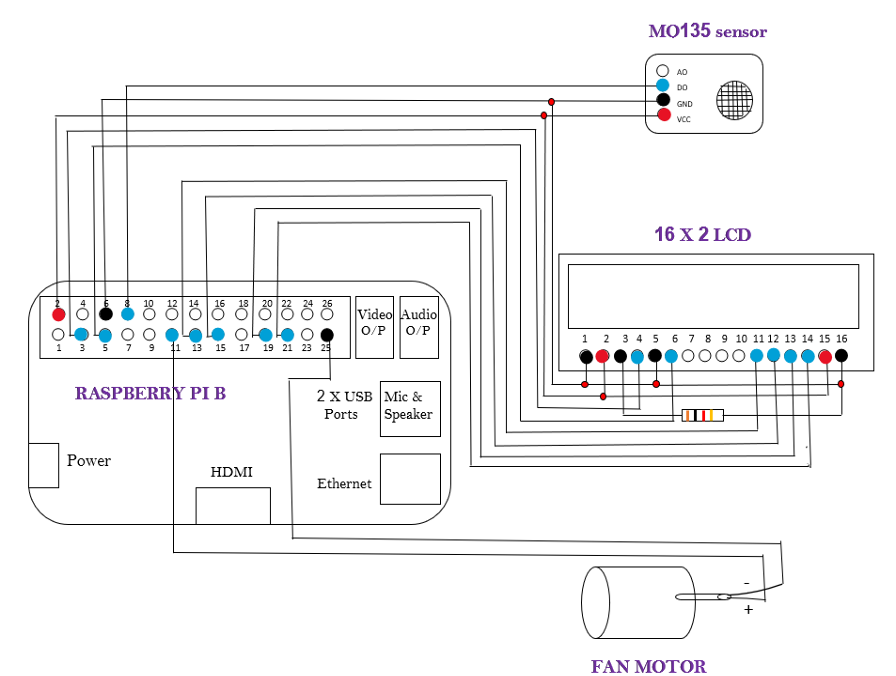

# Raspberry Pi based Voice-Controlled Air Purifier with Sleep Aid

A Raspberry Pi–powered air purifier that responds to **voice commands** to turn on/off, report **air quality status**, and play **relaxing sleep music**. Combines **air filtration** (HEPA + UV), **speech recognition**, and a **user feedback system** via LCD, audio, and LED indicators — making it a perfect smart home appliance.

---

## 🔧 Features

- 🎤 Voice-activated purifier control ("turn on", "turn off", "music on", "music off", "exit")
- 🌬️ Air quality monitoring using **MQ135 gas sensor**
- 😴 Built-in **sleep aid** system with relaxing music playback
- 🖥️ Real-time status on **16x2 LCD display**
- 🔊 Audio feedback via speaker (startup/stop music tones)
- 💡 Visual alert with **LED indicator**
- 🍃 Air purification with **HEPA filter + 12V fan**

---

## 🧠 Technologies Used

- Raspberry Pi (Python)
- `speech_recognition` for voice control
- `pygame` for audio output
- `gpiozero`, `RPi.GPIO` for hardware control
- `Adafruit_CharLCD` for LCD interfacing
- External hardware: MQ135 sensor, fan, HEPA, mic, speaker

---

## 🧰 Hardware Components

| Component              | Description                    |
|------------------------|--------------------------------|
| 🧠 Raspberry Pi         | Main controller                |
| 🌫️ MQ135 Sensor         | Air quality/gas detection      |
| 💨 12V DC Fan           | Air circulation                |
| 🧼 HEPA Filter          | Air purification               |
| 🎤 USB Microphone       | Voice input                    |
| 🔈 Speaker              | Audio feedback/music           |
| 🖥️ 16x2 LCD Display     | Status updates                 |
| 💡 LED (Red)           | Air quality visual indicator   |
| 🔌 DC Adapter           | Power supply                   |
| 🧵 Jumper wires, Frame  | Assembly components            |

---

## 🗂️ Project Workflow

1. **Air Quality Monitoring**
   - MQ135 sensor reads the air quality.
   - GPIO pin triggers visual and text status on LCD ("Good" or "Bad").

2. **Voice-Controlled Actions**
   - Raspberry Pi listens for keywords using a mic.
   - Recognizes commands via Google Speech Recognition:
     - `"turn on"` – Activates purifier + LED
     - `"turn off"` – Deactivates purifier + LED
     - `"music on"` – Plays sleeping music
     - `"music off"` – Stops music
     - `"exit"` – Shuts down system safely

3. **Sleep Aid Functionality**
   - Plays relaxing `.mp3` from local directory
   - Adjustable volume via `pygame`

4. **LCD Display**
   - Shows date and real-time air status
   - Refreshes every few seconds for updated readings

---

## 💻 Getting Started

### 📥 1. Flash Raspbian OS

1. Download **Raspberry Pi Imager** or use [Win32DiskImager](https://launchpad.net/win32-image-writer/+download)
2. Flash the image to your SD card (Raspbian recommended)
3. Boot Raspberry Pi and expand filesystem (`raspi-config`)
4. Connect peripherals (mic, speaker, LCD, sensor, fan)

### 📦 2. Install Dependencies

```bash
sudo apt update
sudo apt install python3-pip
pip3 install speechrecognition pygame gpiozero RPi.GPIO Adafruit-CharLCD
```

## 📌 Circuit Diagram / Pin Configuration


